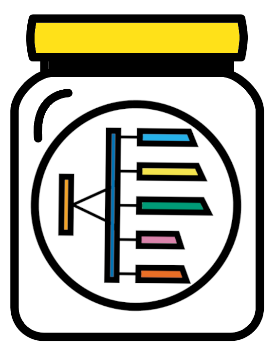

--- 
title: "Bacterial 16S metabarcoding supplemental"
author: "Matthew R. Gemmell"
date: "`r Sys.Date()`"
site: bookdown::bookdown_site
output: bookdown::gitbook
documentclass: book
bibliography: [book.bib, packages.bib]
biblio-style: apalike
link-citations: yes
favicon: figures/NEOF_favicon.png
description: NEOF book for the Introduction to command line bioinformatics workshop
cover-image: "figures/NEOF.png"
---

```{r, echo=FALSE}
#Change colour, border, and text of code chunks
#Check style.css for .Rchunk
#https://stackoverflow.com/questions/65627531/change-r-chunk-background-color-in-bookdown-gitbook
#https://bookdown.org/yihui/rmarkdown-cookbook/chunk-styling.html
knitr::opts_chunk$set(class.source="Rchunk") 
```

<center>
{style="width:300px"}
</center>

# Introduction
<center>
{style="width:200px"}
</center>

This bookdown is a supplement to the main one. It contains some workflows and tools that are not part of the core QIIME2 workflow. However, they may prove useful depending on your needs.

The sections in this supplement will cover:

- [Exporting QIIME2 artifacts to text files](#export)
- [Handy QIIME2 commands](#handy)
- [Introduction to some R packages for 16S rRNA analysis](#rpackages)

Ensure you have the QIIME2 environment activated for all of these materials. For convenience the command is:

```{bash eval=FALSE}
. useqiime2-amplicon-2025.10
```

## Table of contents {-}

```{r, echo=FALSE, align="centre"}
#Create 2 coilumn dataframe
column_1 <- c(
 '[__Exporting QIIME2 artifacts__](#export)',
 '[{height="150"}](#differential)',
 '[__Other QIIME2 resources__](#qiime2_resources)',
 '[{height="150"}](#qiime2_resources)'
)
column_2 <- c(
 '[__Handy QIIME2 commands__](#handy)',
 '[{height="150"}](#final)',
 '[__R packages for 16S rRNA analysis__](#rpackages)',
 '[{height="150"}](#resources)'
)
table_df <- data.frame(column_1, column_2)
#Kable and kableextra libraries
library(knitr)
library(kableExtra)
#Create table
#ALign both column in centre (align = "cc")
table_df %>%
  kbl(align= "cc", col.names = NULL) %>%
  kable_styling(position = "center")
```


<a rel="license" href="http://creativecommons.org/licenses/by-nc-sa/4.0/"></a><br />This work is licensed under a <a rel="license" href="http://creativecommons.org/licenses/by-nc-sa/4.0/">Creative Commons Attribution-NonCommercial-ShareAlike 4.0 International License</a>.