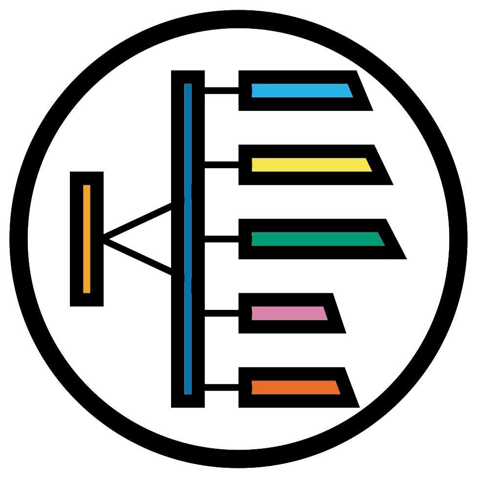

```{r cite-packages, include = FALSE}
# automatically create a bib database for R packages
# add any packages you want to cite here
knitr::write_bib(c(
  .packages(), 'bookdown', 'webexercises'
), 'packages.bib')
```

```{r, echo=FALSE}
#Change colour, border, and text of code chunks
#Check style.css for .Rchunk
#https://stackoverflow.com/questions/65627531/change-r-chunk-background-color-in-bookdown-gitbook
#https://bookdown.org/yihui/rmarkdown-cookbook/chunk-styling.html
knitr::opts_chunk$set(class.source="Rchunk") 
```

<center>
{style="width:300px"}
</center>

# Introduction

<center>
{style="width: 300px"}
</center>

Sequencing of the <u id='s_tip'>16S rRNA</u> gene is a well established method of determining the bacterial taxonomic composition of microbiomes. 
This has been used for human and animal body sites, soil, sewage, clouds, deserts, permafrost and many other environments. 
This course will give you the ability to describe the advantages and disadvantages of <u id='s_tip'>16S rRNA</u> sequencing, and analyse <u id='s_tip'>16S rRNA</u> datasets with the QIIME2 bioinformatics platform.

Sessions will start with a brief presentation followed by self-paced computer practicals guided by this online interactive book. 
This book will contain theory and practice code. Multiple choice questions will guide the interpretation of results.

At the end of the course learners will be able to:

- Utilise and understand the use of QIIME2 with <u id='s_tip'>16S rRNA</u> data.
- Import sequencing data and metadata into QIIME2 artifacts.
- Cluster and denoise <u id='s_tip'>16S</u> sequences with DADA2.
- Assign taxonomies to <u id='asv_tip'>ASVs</u> and produce a phylogenetic tree.
- Evaluate and normalise sequencing depth across their samples.
- Produce <u id='alpha_tip'>alpha</u> and <u id='beta_tip'>beta</u> diversity metrics and statistics.
- Carry out differential abundance analysis.

There are [supplementary materials](https://neof-workshops.github.io/16S_yg84o9/Supplemental/01-16S_supplemental.html) including exporting of QIIME2 <u id='artifact_tip'>artifacts</u>, various handy QIIME2 commands, and introduction to some useful R packages. These can be run through after the course.

## Table of contents {-}

```{r, echo=FALSE, align="centre"}
#Create 2 column dataframe
column_1 <- c(
 '[**Background on the biology**](#background)', 
 '[{height="150"}](#background)',
 '[**Cluster and webVNC information**](#cluster)',
 '[{height="150"}](#cluster)',
 '[**QIIME2 analysis workflow**](#q2workflow)',
 '[{height="150"}](#q2workflow)',
 '[**PCR primer trimming**](#pcrtrim)',
 '[{height="150"}](#pcrtrim)',
 '[**Taxonomic classification**](#taxa)',
 '[{height="150"}](#taxa)',
 '[**Rarefaction curve**](#rarefaction)',
 '[{height="150"}](#rarefaction)',
 '[**Differential abundance analysis**](#differential)',
 '[{height="150"}](#differential)',
 '[**Appendix**](#resources)',
 '[{height="150"}](#resources)'
)
column_2 <- c(
  '[**Introduction to QIIME2**](#introqiime2)',
 '[{height="150"}](#introqiime2)',
 '[**Data**](#data)',
 '[{height="150"}](#data)',
 '[**Sequence import**](#import)',
 '[{height="150"}](#import)',
 '[**DADA2 denoising**](#dada2)',
 '[{height="150"}](#dada2)',
 '[**Phylogenetic tree construction**](#phylogeny)',
 '[{height="150"}](#phylogeny)',
 '[**Alpha and beta diversity analysis**](#diversity)',
 '[{height="150"}](#diversity)',
 '[**Final considerations**](#final)',
 '[{style="height:150px"}](#final)',
 "",""
)
table_df <- data.frame(column_1, column_2)
#Kable and kableextra libraries
library(knitr)
library(kableExtra)
#Create table
#ALign both column in centre (align = "cc")
table_df %>%
  kbl(align= "cc", col.names = NULL) %>%
  kable_styling(position = "center")
```

<a rel="license" href="http://creativecommons.org/licenses/by-nc-sa/4.0/"></a><br />This work is licensed under a <a rel="license" href="http://creativecommons.org/licenses/by-nc-sa/4.0/">Creative Commons Attribution-NonCommercial-ShareAlike 4.0 International License</a>.

```{r, echo=FALSE}
#Tippy tooltips
tippy::tippy_this(elementId = "s_tip", 
                  tooltip = "16S ribosoma RNA",
                  arrow = TRUE, placement = "bottom")
tippy::tippy_this(elementId = "otu_tip", 
                  tooltip = "Operational Taxonomy Unit",
                  arrow = TRUE, placement = "bottom")
tippy::tippy_this(elementId = "asv_tip", 
                  tooltip = "Amplicon Sequence Variant",
                  arrow = TRUE, placement = "bottom")
tippy::tippy_this(elementId = "alpha_tip", 
                  tooltip = "Alpha diversity values are based on single samples",
                  arrow = TRUE, placement = "bottom")
tippy::tippy_this(elementId = "beta_tip", 
                  tooltip = "Beta diversity values based on pairwise comparisons",
                  arrow = TRUE, placement = "bottom")
tippy::tippy_this(elementId = "artifact_tip", 
                  tooltip = "Artifact files are specific to QIIME2 and can contain data (.qza) or visualisations (.qzv)",
                  arrow = TRUE, placement = "bottom")
```