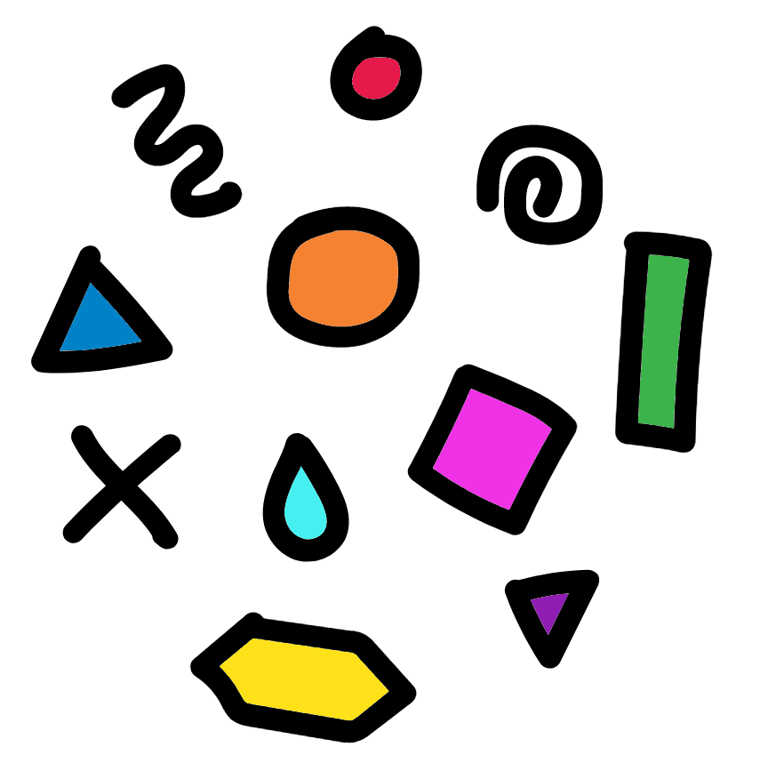

```{r cite-packages, include = FALSE}
# automatically create a bib database for R packages
# add any packages you want to cite here
knitr::write_bib(c(
  .packages(), 'bookdown', 'webexercises'
), 'packages.bib')
```

```{r, echo=FALSE}
#Change colour, border, and text of code chunks
#Check style.css for .Rchunk
#https://stackoverflow.com/questions/65627531/change-r-chunk-background-color-in-bookdown-gitbook
#https://bookdown.org/yihui/rmarkdown-cookbook/chunk-styling.html
knitr::opts_chunk$set(class.source="Rchunk") 
```

```{r, fig.align = 'center',out.width= '30%', echo=FALSE }
knitr::include_graphics(path = "figures/NEOF.png", auto_pdf = TRUE)
```

# Introduction

```{r, fig.align = 'center',out.width= '30%', echo=FALSE }
knitr::include_graphics(path = "figures/intro_logo.png", auto_pdf = TRUE)
```

This practical session aims to introduce you to the analysis of bacterial 16S metabarcoding with QIIME2. The topics covered are:

+:----------------------------------------------------:+:---------------------------------------------------:+
| [**Background on the biology**](#background)         | [**Introduction to QIIME2**](#introqiime2)          |
|                                                      |                                                     |
| {width="150"}             | {width="469"}                |
+------------------------------------------------------+-----------------------------------------------------+
| [**Cluster and webVNC information**](#cluster)       | [**Information on initial data**](#data)            |
|                                                      |                                                     |
| {width="153"}                | {width="125"}            |
+------------------------------------------------------+-----------------------------------------------------+
| [**QIIME2 analysis workflow**](#q2workflow)          | [**Sequence import**](#import)                      |
|                                                      |                                                     |
| {width="154"}               | {width="149"}                |
+------------------------------------------------------+-----------------------------------------------------+
| [**PCR primer trimming**](#pcrtrim)                  | [**DADA2 denoising**](#dada2)                       |
|                                                      |                                                     |
| {width="154"}                | {width="164"}              |
+------------------------------------------------------+-----------------------------------------------------+
| [**Taxonomic classification**](#taxa)                | [**Phylogenetic tree construction**](#phylogeny)    |
|                                                      |                                                     |
| {width="158"}         | {width="130"}            |
+------------------------------------------------------+-----------------------------------------------------+
| [**Rarefaction curve**](#rarefaction)                | [**Alpha and beta diversity analysis**](#diversity) |
|                                                      |                                                     |
| {width="140"}            | {width="150"}             |
+------------------------------------------------------+-----------------------------------------------------+
| [**Differential abundance analysis**](#differential) | [**Final considerations**](#final)                  |
|                                                      |                                                     |
| {width="158"}         | {width="158"}        |
+------------------------------------------------------+-----------------------------------------------------+
| [**Appendix**](#resources)                           |                                                     |
|                                                      |                                                     |
| {width="158"}         |                                                     |
+------------------------------------------------------+-----------------------------------------------------+

-   [Background on the biology](#background)
-   [Introduction to QIIME2](#introqiime2)
-   [Cluster and webVNC information](#cluster)
-   [Information on initial data](#data)
-   [QIIME2 analysis workflow](#q2workflow)
-   [Sequence import](#import)
-   [PCR primer trimming](#pcrtrim)
-   [DADA2 denoising](#dada2)
-   [Taxonomic classification](#taxa)
-   [Phylogenetic tree construction](#phylogeny)
-   [Rarefaction curve](#rarefaction)
-   [Alpha and beta diversity analysis](#diversity)
-   [Differential abundance analysis](#differential)
-   [Final considerations](#final)

<a rel="license" href="http://creativecommons.org/licenses/by-nc-sa/4.0/"></a><br />This work is licensed under a <a rel="license" href="http://creativecommons.org/licenses/by-nc-sa/4.0/">Creative Commons Attribution-NonCommercial-ShareAlike 4.0 International License</a>.
