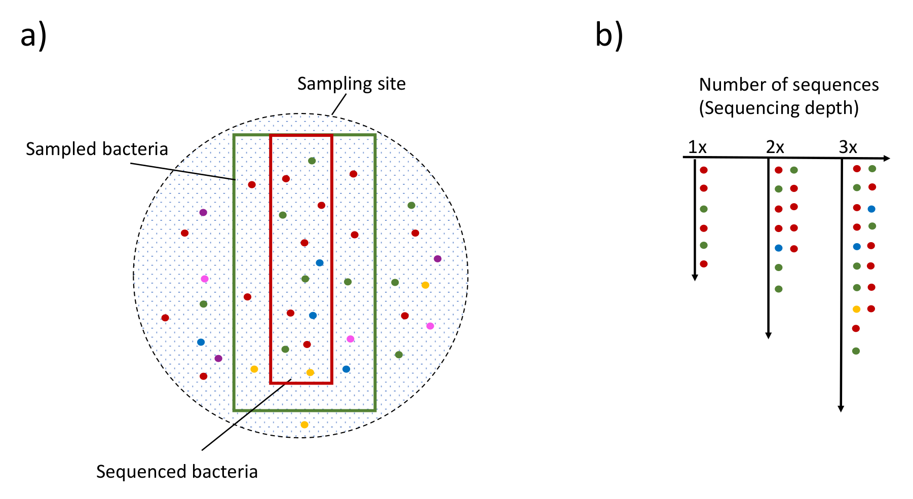

# Background {#background}
<center>
{style="width:200px; border-radius:15px; background:white; border: white solid 5px"}
</center>

One of the most common aims of metagenomic analyses is to quantify the composition and diversity of a community (usually a community of prokaryotes). This can be done in several ways. A common approach is high-throughput <u id='amplicon_tip'>amplicon</u> sequencing, usually of a region of the bacterial <u id='s_tip'>16S SSU rRNA</u> gene. 

In the <u id='amplicon_tip'>amplicon</u> sequencing approach, <u id='amplicon_tip'>amplicons</u> act as ‘tags’ identifying the different bacterial species present in the sample.
These can be both identified and quantified to describe the composition of the bacterial community (also called _metagenetics_ or _metaprofiling_). 

In this workshop, we will analyse <u id='amplicon_tip'>amplicon</u> sequencing data, obtained by amplification of the variable region 4 of the <u id='s_tip'>16S gene</u>, using primer 515FB-806RB (Caporaso _et al_, 2011). 
The sequences were obtained from the Illumina MiSeq platform, 2x250bp reads, and the analysis process will be based on the software package QIIME2 ("Quantitative Insights Into Microbial Ecology", https://qiime2.org). 
We will explore the bacterial populations sampled at various locations in the University of Liverpool's Bioscience building: toilets and corridors from different floors.

A different approach to metagenetics/<u id='amplicon_tip'>amplicons</u> sequencing is shotgun metagenomic sequencing, where the whole genomic content of a sample is sequenced.
In this approach, whole genomes, rather than just representative amplicons, are sequenced (_shotgun metagenomics_). This DNA can be assembled, or the source of the reads can be identified and quantified in a broadly similar way to <u id='s_tip'>16S</u> analysis.
This is not covered in the workshop but we (NEOF) do have a Shotgun Metagenomic workshop.
Please check our [training page](https://neof.org.uk/training/) to see if registration is open for our next Shotgun metagenomics course.

## 16S rRNA

16S ribosomal RNA is a structural RNA which is a component of the prokaryotic ribosome. Ribosomes are the site of protein synthesis, therefore all prokaryotes have at least a <u id='s_tip'>16S rRNA</u> gene that codes for the <u id='s_tip'>16S ribosomal RNA</u>.

The <u id='s_tip'>16S rRNA</u> gene is utilised in reconstructing phylogenies due to its slow rate of evolution, its size and its functional constancy. 
If the function of <u id='s_tip'>16S rRNA</u> changed then the cell could not synthesise proteins correctly and so will not survive.

The <u id='s_tip'>16S rRNA</u> gene is ~1,500bp long and consists of 9 variable regions separated by conserved regions. 
The variable regions evolve at a faster rate allowing differentiation between bacterial taxa. 
The conserved regions evolve at a slower rate which allows areas to carry out universal amplification on the gene, allowing for <u id='amplicon_tip'>amplicon</u> sequencing. 
The nine variable regions are generally called V1, V2, V3 etc.

<center>
{style="width: 600px; border-radius:5px"}
</center>
Secondary structure of <u id='s_tip'>16S rRNA</u> of Esherichia coli (Yarza _et al_, 2014)

## ITS and other possible marker genes
<center>
{style="width: 200px; border-radius:15px; background:white; border: white solid 5px"}
</center>
  
It is very common to perform analysis with marker genes other than <u id='s_tip'>16S</u>, e.g. to study communities of fungi, insects or other eukaryote species. 
From the perspective of the bioinformatics analysis, the same overall pipeline can be used for most of the marker genes. 

ITS (Internal Transcribed Spacer) is a commonly used marker alternative to <u id='s_tip'>16S</u>. 
QIIME2 can be used to analyse ITS with a few steps and commands required which are unnecessary for <u id='s_tip'>16S rRNA</u> data. 
In this tutorial, locations will be highlighted where you should consider a pipeline variation if you are using ITS. 
In general, we recommend searching the literature so you can be aware of the state-of-the-art methods for the analysis of your marker of interest.

## Amplicon sequencing

The use of high-throughput <u id='amplicon_tip'>amplicon</u>-sequencing has proven to be powerful and accurate for microbial community analysis. 
It is currently the preferred choice used to investigate biological communities (bacterial or eukaryotic) in many samples and conditions. 

Some of the reasons for this method's popularity are:

- It is relatively easy to perform.
- It can be performed with many samples.
- It is relatively fast and cheap.

On the negative side, there are many steps which may potentially introduce biases in the final result:

- Experimental design, sampling, storage and DNA extraction methods are known to potentially reduce the initial bacterial population processed and sequenced. 
- Any reagent used may add exogenous bacterial population to the samples (potentially contaminating or changing the initial bacterial amount).
- Several papers discuss how the PCR protocol used for the amplification of the DNA material may affect the final results (such as the creation of chimeric sequences or by preferentially amplifying certain bacterial species). 
- The choice of sequencing platform may result in the identification of different species in the same samples by having its own characteristic error-profile.
- From the bioinformatics perspective, the length of the sequences, and the pipeline used for the analysis are also able to add variability to the final results.
- The identification of the species in the samples can be affected by the quality and completeness of the database used for the analysis. Additionally, it may become less precise at lower taxonomy levels such as ‘genus’ and ‘species’ (Hugerth and Andersson, 2017).

All these aspects need to be taken into account in the discussion of the results.

<center>
{style="width:900px; border-radius:5px"}
</center>

Above shows a representation of amplicon sequencing.

A) Different species are shown as different colours, with the indication of which species are in the site under investigation. Some species may be excluded from the sequencing because they are:
   - Missed by the sampling methods (purple dots)
   - Lost during the sample preparation (outside green square)
   - Lost by the extraction technique (outside green square)
   - Not amplified in the PCR step (outside red square)
B) Representation of the number of sequences obtained for a sample, showing that increasing the number of sequences increases the probability to retrieve low-abundant species in the samples. The main purpose for this analysis is to infer the number and type of species in the initial sampling site by the abundance of the sequences obtained by the sequencing experiment. In order to do this effectively, the use of mock communities and negative controls is strongly suggested to evaluate the effect of any possibly introduced bias. Additionally, normalisation of the data is absolutely necessary to compare the diversity between sample groups.

```{r, echo=FALSE}
#Tippy tooltips
tippy::tippy_this(elementId = "s_tip", 
                  tooltip = "16S ribosomal RNA",
                  arrow = TRUE, placement = "bottom")
tippy::tippy_this(elementId = "otu_tip", 
                  tooltip = "Operational Taxonomy Unit",
                  arrow = TRUE, placement = "bottom")
tippy::tippy_this(elementId = "asv_tip", 
                  tooltip = "Amplicon Sequence Variant",
                  arrow = TRUE, placement = "bottom")
tippy::tippy_this(elementId = "alpha_tip", 
                  tooltip = "Alpha diversity values are based on single samples",
                  arrow = TRUE, placement = "bottom")
tippy::tippy_this(elementId = "beta_tip", 
                  tooltip = "Beta diversity values based on pairwise comparisons",
                  arrow = TRUE, placement = "bottom")
tippy::tippy_this(elementId = "artifact_tip", 
                  tooltip = "Artifact files are specific to QIIME2 and can contain data (.qza) or visualisations (.qzv)",
                  arrow = TRUE, placement = "bottom")
tippy::tippy_this(elementId = "amplicon_tip", 
                  tooltip = "Sequences created by amplifying (e.g. PCR) and sequencing (e.g. Illumina) a targeted region of DNA (e.g. 16S rRNA region)",
                  arrow = TRUE, placement = "bottom")
```