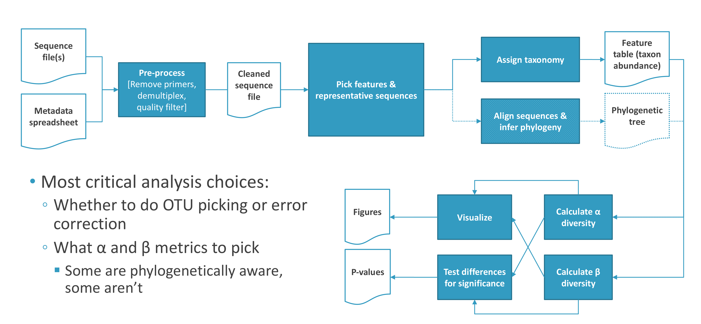

# Introduction to QIIME2 {#introqiime2}
<center>
{style="width:200px; background:white; border-radius:5px; border: white 2px solid"}
</center>

Since January 2018, the QIIME project released the QIIME2 (qiime2.org, Bolyen et al., 2018) pipeline to analyse <u id='amplicon_tip'>amplicon</u> sequencing data.
In the following practical we will use the QIIME2 version released on October 2024 (given the active development on the tool this may not be the most recent release at the time of this workshop). 

If you want to install QIIME2 on your own machine, please refer to: 
https://library.qiime2.org/quickstart/amplicon

## Artifacts
<center>
{style="width:150px; background:white; border-radius:5px"}
</center>

The QIIME2 pipeline produces and uses <u id='artifcat_tip'>artifact</u> files. 
These contain data and metadata and may be of two types: result or visualisation. 

- __Result files (.qza)__: This file type contains the results of a method, which accepts other <u id='artifact_tip'>artifacts</u> and specific settings as input, in order to apply a procedure creating a new <u id='s_tip'>artifact</u> (e.g. loading sequences, error correction, <u id='alpha_tip'>alpha-</u> or <u id='beta_tip'>beta</u>-diversity).
- __Visualisation files (.qzv)__: This file type contains the results of a specific procedure to obtain an object that can only be used to visualize the results. 
These files can be loaded into the following web-site https://view.qiime2.org, where the interactive visualisations can be viewed. Please note that only chrome and Firefox are supported by this QIIME2 view website.

## Workflow
<center>
{style="width:150px; background: white; border-radius:5px"}
</center>

The steps for the analysis are listed below.

<center>
{style="width:800px; BORDER-RADIUS:5PX"}
</center>
Representation of the steps proposed for the analysis ([Source](http://compbio.ucsd.edu/wp-content/uploads/2016/10/20170712_microbiome_16s_tutorial_non-interactive.pdf))

1. Prepare the sequence dataset
    a. Remove PCR primers
2. <u id='amplicon_tip'>Amplicon</u> Sequence Variants identification
3. Assign a taxonomic classification to each <u id='asv_tip'>ASV</u>
    a. Train naive-classifier for assignment
    b. Taxonomy assignment of the identified <u id='asv_tip'>ASVs</u>
4. Make a phylogeny tree for the <u id='asv_tip'>ASVs</u>
    a. Alignment of the <u id='asv_tip'>ASV</u> representative sequences 
    b. Masking low quality alignment 
    c. Creating the un-rooted phylogenetic tree 
    d. Creating the rooted phylogenetic tree 
5. Summarise the taxonomy data for each sample and plot results 
6. Estimate and plot <u id='alpha_tip'>alpha diversity</u> 
7. Estimate and plot <u id='beta_tip'>beta diversity</u>
8. Differential abundance analysis

## Prepare the sequence dataset
<center>
{style="width:150px; background: white; border-radius:5px; border: 5px white solid"}
</center>

You will be using a raw dataset as the tutorial data. It still includes low quality sequences, Illumina sequencing adapters as well as PCR primers. Before proceeding with the analysis, it is a good strategy to investigate the quality of the sequences. 

The PCR primers used for the amplification may have degenerate positions (required for annealing to the large variety of species in the samples). This adds 'random' variability outside the target region. These unknown sequences may affect the subsequent taxonomy identification as well as the error-correction step. We will use Cutadapt to remove the PCR primers before any other step. 

If the analysis is based on a marker gene different than <u id='s_tip'>16S</u>, other quality trimming may be required. In the case of the ITS marker gene, the common practice is to trim off the conserved regions (SSU, 5.8S or LSU) that may be contained in the final amplicon. The ‘ITSxpress’ software (Rivers _et al_., 2018) is designed for this specific task and it is available as a QIIME2 plug-in,  though it requires specific installation steps because it is not installed with the basic (core) installation process. Plugins page for `ITSxpress`: (https://old-library.qiime2.org/plugins/q2-itsxpress/8/)

For all plugins see the following 2 pages:

- Plugins webpage of new QIIME2 site (not all plugins transferred to new site): https://library.qiime2.org/pluginshttps://docs.qiime2.org/2024.5/plugins/available/.
- Plugins webpage of old QIIME2 site (These should still work for newer version of QIIME2): https://old-library.qiime2.org/plugins/.

## Amplicon Sequence Variants identification

The key element of this type of metagenomic analysis is the identification of the different rRNA variants in the sample. 

### OTUs
<center>
{style="width:150px; background:white; border-radius:5px; border: white solid 5px"}
</center>

The most used procedure to identify <u id='otu_tip'>OTUs</u> is through the clustering of reads into groups that are sufficiently similar to one another. 
These grouped reads are likely to come from the same rRNA gene, genome or taxa group. 

The identified <u id='otu_tip'>OTUs</u> are a feature of the sequence dataset, heavily dependent on the similarity level used for <u id='otu_tip'>OTU</u> identification. 
The most commonly used threshold was 3% dissimilarity (i.e 97% similarity) to group reads into species <u id='otu_tip'>OTUs</u>. 
Therefore, de novo <u id='otu_tip'>OTUs</u> identified in two different data sets cannot be compared. 

There is no single perfect tool for this step; but a few of the most widely used were:

- UCLUST
- VSEARCH
- CD-Hit
- SWARM

The number of reads in each <u id='otu_tip'>OTU</u> should reflect the number of copies of the gene in the sample, thus providing a quantitative measure of diversity. 

### ASVs
<center>
{style="width:150px; background: white; border-radius:5px; border: white 5px solid"}
</center>

There are now many bioinformatic methods to resolve <u id='asv_tip'>ASVs</u> from Illumina data. 
These methods do not impose the arbitrary dissimilarity thresholds that define molecular <u id='otu_tip'>OTUs</u>.
Due to this we recommend using <u id='asv_tip'>ASVs</u> over <u id='otu_tip'>OTU</u> clustering for metagenetic analysis (unless you have a good reason to use OTU clustering).
The two methods available in QIIME2 are DADA2 and deblur.

<u id='asv_tip'>ASV</u> methods infer the biological sequences in the sample prior to the introduction of amplification and sequencing errors, and distinguish sequence variants differing by as little as one nucleotide. 
The methods use a de novo process in which biological sequences are discriminated from errors on the basis of, in part, the expectation that biological sequences are more likely to be repeatedly observed than error-containing sequences.

Unlike de novo <u id='otu_tip'>OTUs</u>, <u id='asv_tip'>ASVs</u> are consistent labels because <u id='asv_tip'>ASVs</u> represent a biological reality that exists outside of the data being analysed: the DNA sequence of the assayed organism. 
Thus, <u id='asv_tip'>ASVs</u> inferred independently from different studies or different samples can be compared.

The following picture shows how DADA2 (an <u id='asv_tip'>ASV</u> method) and <u id='otu_tip'>OTU</u> processes compare to each other. 
This shows how the canonical creation of <u id='otu_tip'>OTUs</u> by clustering may lead to an overestimation of the size of the <u id='otu_tip'>OTUs</u> due to the presence of errors, from either PCR or sequencing.

<center>
{style="width:800px; border-radius:5px; border: 5px solid white"}
</center>

Much of the work involved in the analysis of amplicon-based metagenomic data is that of separating true variants from errors introduced by sequencing. 
These errors include miscalling of nucleotides and the generation of chimeric sequences.

For sequencing purposes, an aliquot of PhiX phage DNA is added to each sample before sequencing, both DADA2 and deblur include a step aimed to exclude any PhiX associated reads. 
To remove PCR chimeric artefacts, a further filter step is applied by both. 

QIIME 2 Authors suggest using DADA2 for read pairs and ‘deblur’ for already paired (stitched/joined) sequences. 
Please note that it is good practice to remove/trim out sequences containing Ns before the error correction step. 
It is not suggested to denoise with DADA2 samples from different sequencing lanes, because each lane may introduce different sequencing biases. 
It is possible to collate the denoised abundance tables and representative sequences afterwards, recording the sequencing lane for each sample in a specific metadata column. 
The ‘deblur’ denoise tool may be used in this case because it should be less sensitive to these possible biases, however it is good practice to keep the lane of origin in the metadata (with the second benefit that ‘deblur’ is also faster than ‘DADA2’).

## Assign a taxonomic classification to each ASV
<center>
{style="width:150px; background: white; border-radius:5px"}
</center>

The sequence of each <u id='asv_tip'>ASV</u> is compared with the selected database, to identify the most likely taxonomy for each <u id='asv_tip'>ASV</u>. 
Unfortunately different parts of the taxonomic identification step may lead to different results for the same <u id='asv_tip'>ASV</u>. 

Different databases may result in different taxonomic classification for the same <u id='asv_tip'>ASV</u>. 
The choice of tool used for taxonomic assignment may also impact the results in a similar way. 
The current version of QIIME2 allows you to select from either the Scikit-learn classifier (a classifier which applies a machine learning approach and therefore needs training before use) or BLAST+ and VSEARCH (for a global alignment approach followed by a last common ancestor search) for this step. 

In the practical we will use Scikit-learn (similar to the RDP tool widely used so far). It has been shown that (at least in the case of <u id='s_tip'>16S</u> analysis) taxonomic classification accuracy improves when the classifier is trained with sequences derived from the amplicon region only (Werner _et al_., 2012).

## Phylogenetic tree creation
<center>
{style="width:150px; background: white; border-radius:5px"}
</center>

To include phylogenetic diversity metrics in the diversity analysis, such as UniFrac distance metrics, the construction of a phylogenetic tree for the identified <u id='asv_tip'>ASVs</u> is required. 
QIIME2 supports MAFFT for the alignment and MASK to mask the alignment sections that are not phylogenetically informative. 
Unrooted and rooted trees may be created. 

For some marker genes it is not possible to build a phylogenetic tree (ITS is among these), and it is therefore important to know the properties of the marker in use. 
Consequently, it is not possible to use any diversity metrics that requires the phylogenetic distance as input.

## Data normalisation
<center>
{style="width:150px; background: white; border-radius:5px"}
</center>

Any further analyses to compare the identified <u id='asv_tip'>ASVs</u> among sample groups (either <u id='alpha_tip'>alpha-</u> or <u id='beta_tip'>beta-</u>diversity or differential abundance) should account for the features of the abundance table that can cause erroneous results (Weiss et al., 2017). These features are:

1. The microbial community in each sample may be represented by different numbers of sequences (i.e. sequencing depth for each sample).
2. The abundance table is usually sparse. That is, most of the <u id='asv_tip'>ASVs</u> are present only in a few samples and therefore the abundance table contains many ‘0’ values (it is also possible that a particular species is present in a sample but below the detection limit of the methods).
3. The total number of sequences obtained reflect the relative abundance of species sequenced rather that the absolute abundance of the species present in the sample (this is commonly referred as ‘compositional nature’ of the data). The relative abundances for the taxa are therefore not independent as in the underlying assumption of many frequently used statistical methods (Gloor _et al_., 2017).

A normalisation step for the data is required to mitigate these effects and to allow easier data interpretation. The most used normalisation methods are: 

a. Normalisation by rarefaction. This is performed by reducing all the samples at the same sequence count, by random sub-sampling of the sequences.
    - This method may lead to a potential reduction of the species in your dataset (<u id='alpha_tip'>alpha-diversity</u>) and to the exclusion of any samples not reaching the selected total count per sample.
b. DESeq method (borrowed from transcriptomic research)
c. Scaling the abundance table by a fixed value or proportion.
d. Applying a log-ratio transformation proposed by Aitchinson (1982) in analogy of compositional dataset. 
    - This is aimed to convert the abundance data into scales on which it is possible to apply conventional statistical procedures.
    
Methods b-d convert the abundance table in a normalised-abundance table with different strengths and pitfalls, therefore they can affect results for <u id='beta_tip'>beta-diversity</u> and differential abundant analysis.

These normalisation methods were compared by Weiss and colleagues (2017), but their simulations show that different methods may result in different sensitivity and different false discovery rates.

In this tutorial, following the QIIME2 current tutorial and other literature, we will apply the ‘rarefaction’ method, in the context of the <u id='alpha_tip'>alpha-</u> and <u id='beta_tip'>beta-</u>diversity analysis.

## Alpha-diversity
<center>
{style="width:150px; background: white; border-radius:5px"}
</center>

<u id='alpha_tip'>Alpha-diversity</u> is used to measure the diversity within a sample. 
It is calculated as a value for each sample. 
Different metrics were developed to calculate diversity in different ways. 
It combines richness (a measure of the number of features in the sample) and evenness (a measure of the relative abundances of different features that make up the richness of that sample). 

<u id='alpha_tip'>Alpha diversity</u> measures cannot be compared unless they have been normalised for the difference in sequencing depth between samples. 
The QIIME2 release we will use supports the following <u id='alpha_tip'>alpha-diversity</u> measures, amongst others: Chao1, Shannon, Simpson, Simpson evenness, Faith’s Phylogenetic Diversity (the only one considering the phylogenetic relationships among the
<u id='asv_tip'>ASVs</u>).

The <u id='alpha_tip'>alpha-diversity</u> metric used for the analysis must be chosen carefully, considering its mathematical definition in relation to the behaviour of the tools used for the previous steps. 
An important point to consider is whether the chosen metric uses <u id='asv_tip'>ASVs</u> with only 1 sequence (‘singletons’) to perform some estimation on the dataset or not. 
The Chao1 metric, as one example for this, uses the number of singletons in the dataset to infer the total number of singletons in the population. 
However, the DADA2 denoising step excludes ‘singletons’ from the final output, making Chao1 measures not applicable to its resulting abundance tables. 
A second consideration regards if the phylogenetic tree is available enabling the use of the Faith’s Phylogenetic Diversity metric, for markers such as ITS this metric would not be possible.

## Beta-diversity
<center>
{style="width:200px; background: white; border-radius:5px"}
</center>

<u id='beta_tip'>Beta-diversity</u> is a term for the comparison of samples to each other. 
It is also referred to as <u id='beta_tip'>beta-diversity</u> ordination, because it uses one (or more) technique/s to arrange samples along axes on the basis of their composition to highlight the differences. 
The starting point of the analysis is a dissimilarity matrix, which is used to perform a Principal Component Analysis (PCA) to reduce the dimension for display purpose. 
The axes obtained from the PCA analysis are then compared with the categories in the metadata file to identify patterns. 

A few of the commonly used <u id='beta_tip'>beta diversity</u> metrics supported by QIIME2 are:

- __Jaccard:__ A non-phylogeny based method that takes into account the presence/absence of <u id='asv_tip'>ASVs</u> to measure the distance between two samples.
- __Bray-Curtis:__ A non-phylogeny based method that takes into account the number of <u id='asv_tip'>ASVs</u> and their abundance to determine the distance between two samples.
- __Un-weighted UniFrac:__ Uses the presence and absence of <u id='asv_tip'>ASVs</u> and their phylogenies.
- __Weighted UniFrac:__ Uses the abundance information of <u id='asv_tip'>ASVs</u> and their phylogenies.

As discussed for the <u id='alpha_tip'>alpha-diversity</u>, before proceeding with the <u id='beta_tip'>beta-diversity</u> analysis the raw abundance table for the identified <u id='asv_tip'>ASVs</u> needs to be normalised. 
QIIME2 suggests using the rarefaction methods at the same rarefaction threshold used for the alpha diversity.

The choice of the <u id='beta_tip'>beta-diversity</u> distance metric to use will strongly affect the results. 
Therefore it is common practice to compare the results obtained with different metrics. 
Again, not all the metrics may be applicable to all the marker genes. E.g. the UniFrac distances could not be easily used in the case of ITS, because ITS sequences are quite difficult to align onto phylogenetic trees.

## Differential Abundance Analysis
<center>
{style="width:200px; background: white; border-radius:5px"}
</center>

The identification of taxa that are differentially abundant across experimental conditions may be an important result for many types of metagenetics analyses. This step is extremely dependent on the normalization methods used to compare the samples: using different normalisation methods may lead to different results (consequently this is another active area of research).

QIIME2 supports two methods to investigate differentially abundant taxa across experimental conditions: ANCOM-BC (Lin & Peddada, 2020) and GNEISS (Morton et al, 2017). 
Both methods are based on the conversion of the abundance values using the clr-transformation method prior to any comparison. 
Because the conversion is based on a logarithmic transformation, all the values in the abundance table will be increased by ‘1’ to avoid ‘0’ counts (adding pseudo-counts). 
These methods may therefore artificially increase the <u id='alpha_tip'>alpha-diversity</u> for the samples as well as decrease the <u id='beta_tip'>beta-diversity</u> distances in the dataset. 

In this analysis we will use the ANCOM-BC method following the current QIIME2 tutorial. 
This method computes the log-ratio for every possible pair of the identified taxa (using the mean group values for the clr-transformed abundance) and reports how many times the hypothesis “H 0 = X is not differentially abundant” is rejected for each taxa ‘X’. 
That is the ‘W’ statistic, the higher this value is the more significant the <u id='asv_tip'>ASV</u>/taxa X is differentially abundant between the tested groups. 
This test assumes that a large number of <u id='asv_tip'>ASVs</u> did not change in abundances between groups. 
If, in the results, more than 25% of the <u id='asv_tip'>ASVs</u> changes in the examined contrasts, the underlying hypothesis for the ANCOM-BC test may be not fulfilled, and there is the chance that the results may be misleading.

Important to note is that ANCOM-BC has its own sample-wise normalisation.
Therefore the unnormalised (i.e. pre rarefaction) abundance table shoudl be provided to ANCOM-BC.

Examples of questions to answer:

- Are there differences in taxa at various levels of taxonomy?
- What are the most abundant <u id='asv_tip'>ASVs</u> (or species)?
- What are the rare <u id='asv_tip'>ASVs</u> present (either real or still retained sequencing error)?
- Where are the rare <u id='asv_tip'>ASVs</u> present (if not sequencing error)?
- <u id='asv_tip'>ASVs</u> correlation: is there a correlation between <u id='asv_tip'>ASVs</u> and other attributes of samples, like pH or other environmental conditions?

```{r, echo=FALSE}
#Tippy tooltips
tippy::tippy_this(elementId = "s_tip", 
                  tooltip = "16S ribosomal RNA",
                  arrow = TRUE, placement = "bottom")
tippy::tippy_this(elementId = "otu_tip", 
                  tooltip = "Operational Taxonomy Unit",
                  arrow = TRUE, placement = "bottom")
tippy::tippy_this(elementId = "asv_tip", 
                  tooltip = "Amplicon Sequence Variant",
                  arrow = TRUE, placement = "bottom")
tippy::tippy_this(elementId = "alpha_tip", 
                  tooltip = "Alpha diversity values are based on single samples",
                  arrow = TRUE, placement = "bottom")
tippy::tippy_this(elementId = "beta_tip", 
                  tooltip = "Beta diversity values based on pairwise comparisons",
                  arrow = TRUE, placement = "bottom")
tippy::tippy_this(elementId = "artifact_tip", 
                  tooltip = "Artifact files are specific to QIIME2 and can contain data (.qza) or visualisations (.qzv)",
                  arrow = TRUE, placement = "bottom")
tippy::tippy_this(elementId = "amplicon_tip", 
                  tooltip = "Sequences created by amplifying (e.g. PCR) and sequencing (e.g. Illumina) a targeted region of DNA (e.g. 16S rRNA region)",
                  arrow = TRUE, placement = "bottom")
```