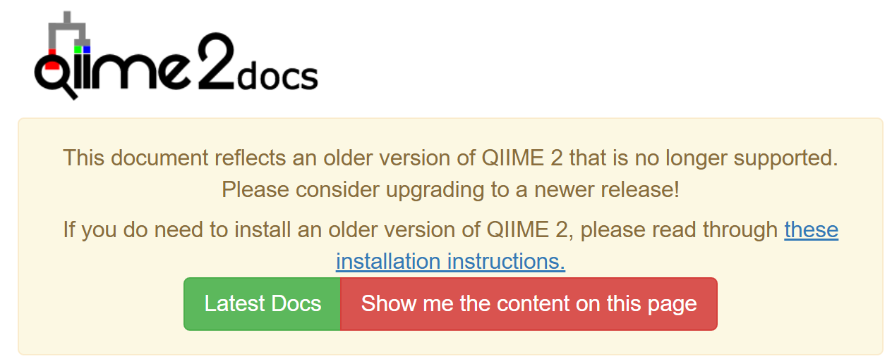

# Data {#data}
<center>
{style="width:200px"}
</center>

Prior to starting analysis you will need three files. To acquire these three files run the following commands.

```{bash eval=FALSE}
#Change directory to home
cd ~
#Make a directory in home called "Metagenetics"
mkdir Metagenetics
#Change directory to "Metagenetics"
cd Metagenetics
#Copy the contents of a directory to your current directory
cp /pub14/tea/nsc206/NEOF/16s_workshop/chapter_5/* .
```

Look at the contents of your current directory and then continue reading for explanations on their contents.

```{bash, eval=FALSE}
ls
```

## PairedEndFastqManifestPhred33.csv {#manifestfile}
<center>
{style="width:200px"}
</center>

This "manifest" file contains three columns that are separated by commas (.csv = comma separated values). This is vital for importing your sequencing data into QIIME2.

Each column has a header and contains the following information:

1. __sample-id__
   - User specified sample-id. 
   - This is how the sample will be named in all downstream QIIME2 files.
   - These must match the sample ids in the metadata file.
   - Recommendations for sample ids/identifiers can be found lower down in this bookdown page.
2. __absolute-filepath__
   - Full path of sequencing file.
3. __direction__
   - Direction of the sequencing reads
   - For paired end reads this will be "forward" (R1) or "reverse" (R2).
   
For paired end read datasets there will be two lines for each sample. One for the forward read file and one for the reverse read file. These two lines must have the same sample-id.

Have a look at the "manifest" file. You will see the header followed by all the forward reads then the reverse reads.

__Tip__: Type `q` to quit `less`

```{bash, eval=FALSE}
less PairedEndFastqManifestPhred33.csv
```

This file will be used in chapter 7.

## metadata.file.txt
<center>
{style="width:200px"}
</center>

This file contains metadata. It consists of columns separated by tabs. 

It is vital that the "sample-id" column contains the same info as the "sample-id" column in "PairedEndFastqManifestPhred33.csv".

This file can contain as many columns as you would like (minimum of 2). The first column must be the "sample-id" column.

The first 2 rows must be:

1. Headers
   - Name of metadata fields.
   - These are chosen by the user (except the sample-id column). Ensure these are informative and concise.
   - We suggest to only use letters and not to use spaces.
2. Column type
   - The value "#q2:types" must be used for the 1st column.
   - For all other columns the value must be:
      - "categorical": For categorical metadata. This will be the most common choice.
      - "numeric": For numerical metadata. 
      
Have a look at the top 10 lines of the metadata file:

```{bash, eval=FALSE}
head metadata.file.txt
```
   
For more information on QIIME2 metadata please see: https://docs.qiime2.org/2023.5/tutorials/metadata/

The above link includes:

- Metadata Formatting Requirements
- Info on empty rows
- Recommendations for identifiers
- Info on column types and number formatting
- More

__Note__: All the QIIME2 links may be out of date and the below will appear:
<center>
{style="width:800px"}
</center>

If this occurs click "Show me the content on this page".

You can then click the version box on the top left (above the table of contents, pictured below) and choose the version you would like. This would be either the version you are using or the latest version.
<center>
{style="width:200px"}
</center>

## primers_seqs.fasta

This is a fasta file containing the forward and reverse 16S rRNA primer sequences. These are needed for the PCR trimming step (chapter 8) and the classifier training step (chapter 10).

This file has been provided so you can copy and paste the sequences from within the webVNC. It is never advisable to try to type sequences.

For your own projects you will need to ask the lab that carried out the sequencing preparation for the primer sequences.