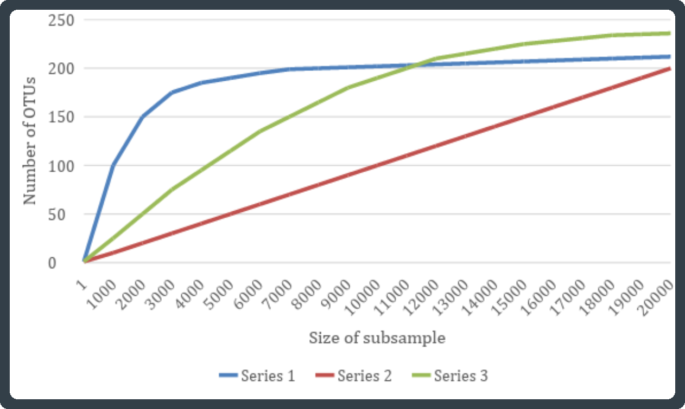

# (PART\*) Analysis {-}

# Sequencing depth evaluation {#rarefaction}
<center>
{style="width:200px"}
</center>

The detected diversity partly depends on the sampling depths. An incompletely sampled community will appear less diverse than a fully sampled community. 

To compare the diversity between samples we need to account for their different sampling depths. This can be carried out with rarefaction. 
Rarefaction is performed by reducing all the samples to the same sequence count, by random sub-sampling of the sequences.

For example, if we rarefy to a depth of 2000 for all samples:

- Samples with depths of <2000 will be removed.
- Samples with depths of 2000 will be unchanged.
- Samples with depths of >2000 will have all reads removed except for a random subsample of 2000.

Equally sized subsamples are directly comparable among different samples. Additionally, we can progressively subsample from a sample to draw a curve of estimated alpha diversity. The shape of this curve is informative. If the curve plateaus, then increased sampling depth will not increase the estimate of alpha diversity (the community is fully sampled). 

<center>
{style="width:800px"}
</center>

```{r, echo=FALSE, eval=FALSE}
#This is set to not run
#Left here in case the resultant plots needs to be recreated or edited
#ggplot2
library(ggplot2)
#subsample sizes
size_for_subsamples <- seq(from = 0, to = 20000, by = 1000)
#number of ASVs will go up to a max of 250
S1 <- c(0,100,150,175,181,185,189,seq(from = 190, by = 1, length.out=14))
S2 <- seq(from = 0, to = 200, length.out = 21)
S3 <- c(0,40,75,104,128,150,168,186,201,212,219,226,231,235,238,241,244,246,248,249,250)
#combine to a long df
df <- as.data.frame(matrix(data = NA, ncol = 3))
colnames(df) <- c("Sample","ASVs","Subsample_size")
df[1:21,"Sample"] <- "S1"
df[1:21,"ASVs"] <- S1
df[1:21,"Subsample_size"] <- size_for_subsamples
df[22:42,"Sample"] <- "S2"
df[22:42,"ASVs"] <- S2
df[22:42,"Subsample_size"] <- size_for_subsamples
df[43:63,"Sample"] <- "S3"
df[43:63,"ASVs"] <- S3
df[43:63,"Subsample_size"] <- size_for_subsamples
#ggplot line plot
gg_line <- ggplot(data = df, aes(y=ASVs, x=Subsample_size, group=Sample, color=Sample  )) +
  geom_line(linewidth = 2) +
  labs(x = "Size of subsample", y = "Number of ASVs" ) +
  scale_color_manual(values=c("#dc267f", "#fe6100", "#648fff")) +
  theme_gray(base_size = 24) +
    theme(legend.position="bottom")
ggsave("./figures/rarefaction_ggplot.png", plot = gg_line, 
       units = "mm", width = 300, height = 175, dpi = 300)
```
<center>
{style="width:800px"}
</center>
Figure: Example rarefaction curve. We can see that S1 plateaus at ~6,000 sequences and S3 plateaus at ~16,000 sequences whilst S2 has not started to plateau.

## Rarefaction: run
<center>
{style="width:150px"}
</center>

Given an abundance table (and a phylogenetic tree for calculating phylogenetic distance), we can plot rarefaction curves using different alpha-diversity metrics. Here, we will use diversity metrics ([observed features](#obvs), [Simpson](#simpson), [Shannon](#shannon), [Faith’s PD](#faith)) as well as an evenness metric ([Simpson’s evenness](#simpsone)).

__Note__: See the [appendix](#alphamet) at the end of this bookdown for details on each metric.

You will need to to exclude `--i-phylogeny rooted-tree.qza` and `--p-metrics faith_pd` for markers such as ITS where you cannot create a phylogenetic tree.

__Important__: This command will take a long time. If this is the last command you run for today that is fine, go ahead and run it. Optionally, you can [copy the output](#cprarefaction) instead of running it.

```{bash, eval=FALSE}
qiime diversity alpha-rarefaction \
--i-table table-dada2.qza \
--i-phylogeny rooted-tree.qza \
--p-min-depth 5000 \
--p-max-depth 130000 \
--p-steps 500 \
--p-iterations 10 \
--m-metadata-file metadata.file.txt \
--p-metrics simpson_e \
--p-metrics simpson \
--p-metrics shannon \
--p-metrics observed_features \
--p-metrics faith_pd \
--o-visualization rarefaction-curve.qzv
```

#### Parameters {-}
<center>
{style="width:100px"}
</center>

- __`--i-table`__: Input artifact containing the abundance table for the identified variants.
- __`--i-phylogeny`__: Input artifact containing the rooted tree.
- __`--p-min-depth`__: Minimum depth to show in the plot (x-axis).
- __`--p-max-depth`__: Maximum depth to show in the plot (x-axis).
  - The minimum and maximum depth are chosen based on your knowledge of the sample depths. This can be figured out from the ['table-dada2.qzv' file](#tabledada2qzv).
- __`--p-steps`__: The number of rarefaction steps to include between the min and max depth.
  - This means there will be x points on the sequence depth axis (x-axis) in the resulting plot.
  - The more steps there are the longer the command will take to run.
  - In your future analysis it may take some experimentation to get a number of steps that is a good amount. Too many steps and it can be messy, too few steps and it can be uninformative
- __`--p-iterations`__: This is the number of rarefaction tables that will created. The final output is based on the average of these tables.
  - Although a very large number would be very good it would also take a very long time. The number of iterations increase the time by that amount (i.e. 2 iterations takes 2 times more than 1 iteration).
  - Ten iterations is generally a good amount.
- __`--m-metadata-file`__: [Metadata file](#metadata.file.txt) for our samples.
- __`--p-metrics`__: This parameter indicates which alpha diversity to use for rarefaction.
  - This parameter can be specified multiple times for different metrics.
- __`--o-visualization`__: Output visualisation artifact containing the rarefaction plots. 

[QIIME2 docs on `qiime diversity alpha-rarefaction`](https://docs.qiime2.org/2024.10/plugins/available/diversity/alpha-rarefaction/)

### Copy rarefaction output {#cprarefaction}
<center>
{style="width:150px"}
</center>

Instead of running the command you can copy the output to your directory.

```{bash eval=FALSE}
cp /pub14/tea/nsc206/NEOF/16s_workshop/chapter_12/rarefaction-curve.qzv .
```


## Rarefaction: visualise
<center>
{style="width:200px"}
</center>

Load the output visualisation artifact into QIIME2 view. You can select the alpha diversity __Metric__ to visualise as well as the groupings (__Sample Metadata Column__, where each __BarcodeSequence__ represents a sample). Generally the [__observed_features__](#obvs) metric is the best __Metric__ to view.

The visualisation has two plots. 

- __Top plot: Alpha rarefaction plot.__
   - Primarily used to determine if the richness of the samples has been fully observed or sequenced.
   - If the lines in the plot appear to "plateau" (i.e., becoming a horizontal line), this suggests that collecting additional sequences beyond that sampling depth will not effect the measured metric. E.g. a plateaued observed feature curve indicates there are no more feature to be detected. 
   - If the lines in the observed feature plot do not level out:
      - The richness of the samples may have not been fully observed (because too few sequences were collected).
      - Or it could be an indicator that a lot of sequencing errors remain in the data (which is being mistaken for novel diversity).
- __Bottom plot: Number of samples (Y) against sequencing depth (X)__
   - This is important when grouping samples by metadata.
   - It illustrates the number of samples with different sequencing depths for the groups in the chosen __Sample Metadata Column__.
   - This is useful as when a sample's sequencing depth is lower than the sequencing depth in the rarefaction plot it will no longer be considered in the rarefaction calculation. This can be seen as jitters in the rarefaction curve corresponding to a decrease in number of samples.
      - If the lost sample had a lower value than the average of the group the curve will jitter upwards, as the group average increases. 
      - If the lost sample had a higher value than the average of the group the curve will jitter downwards, as the group average decreases. 

### Rarefaction considerations
<center>
{style="width:150px; background: white; border-radius:5px"}
</center>

Choosing a rarefaction threshold for the normalisation step, is ultimately identifying the best trade-off between:

- Retaining sequencing depth within samples.
- Not losing entire samples.

The best choice usually depends on the experimental design. If you have many samples per group you may be able to lose a few samples without losing statistical power for the analysis. If you have few samples per group you may need to choose a lower threshold.

Other considerations for rarefaction threshold:

- Do the samples in one group have lower depths? Although you may be able to retain all the samples in the other groups with a high rarefaction threshold you may remove too much of the low depth group.
- Should your samples have relatively high (e.g. soil microbiomes) or low (e.g. human gut microbiome) diversity. With higher diversity you will need a larger rarefaction threshold.

### Rarefaction: MCQs
<center>
{style="width:150px"}
</center>

Attempt the below MCQs.

```{r, echo = FALSE}
opts_p <- c("__10,000__", "__25,000__", answer="__50,000__")
```
1. At approximately what sequencing depth do the rarefaction curves of most of the samples (>90%) plateaue?  `r longmcq(opts_p)`

```{r, echo = FALSE}
opts_p <- c(answer="__Corridor__", "__Toilet__")
```
2. Comparing the two __Locations__, which has higher evenness scores (simpson_e)? `r longmcq(opts_p)`

```{r, echo = FALSE}
opts_p <- c(answer="__Corridor__", "__Toilet__")
```
3. Comparing the two __Locations__, which has a higher Faith's PD scores? `r longmcq(opts_p)`

```{r, echo = FALSE}
opts_p <- c("__70,000__", answer="__90,000__", "__115,000 __")
```
4. When comparing the two __Places__, at approximately what sequencing depth are there only 6 MainBuilding samples remaining?  `r longmcq(opts_p)`

```{r, echo = FALSE}
opts_p <- c("__70,000__", "__90,000__", answer="__115,000__")
```
5. When comparing the two __Places__, at approximately what sequencing depth are there only 5 Entrance samples remaining? `r longmcq(opts_p)`

## Rarefaction: summary
<center>
{style="width:150px"}
</center>

For the next step we will use a rarefaction size of 34,584. We have chosen this depth because:

- This will keep all the samples.
- The group based rarefaction curves (__Location__ and __Place__) are plateauing at this depth.
- Many of the individual samples (__BarcodeSequence__) have plateaued at this depth.
- We do not have a lot of samples so we have prioritised keeping them rather than removing samples for a relatively small gain.

How do we know that the very exact number of 34,584 will keep all the samples? Looking at the __Interactive Sample Detail__ section of the [`table-dada2.qzv`](#tabledada2qzv) visualisation we can see that the lowest depth of a sample is 34,584 (3K1E). Generally people will use the depth of a sample as the rarefaction threshold. E.g. if we were going to choose a rarefaction threshold of >50k we'd pick 58,605 as the exact threshold, this is the lowest sample depth >50k (from sample 1K2M). This allows us to use the maximum amount of sequences per sample.